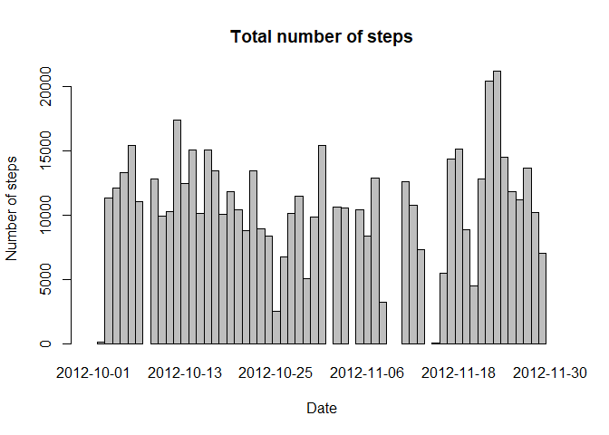
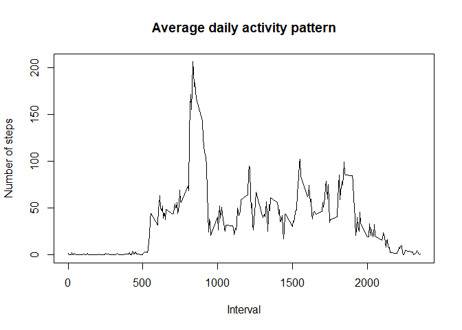
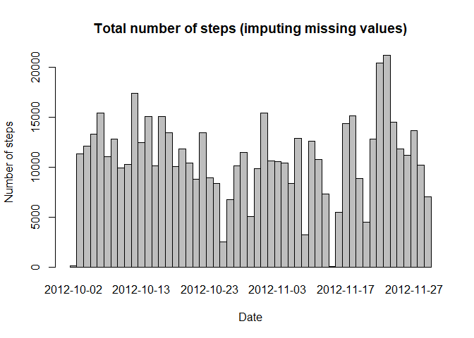
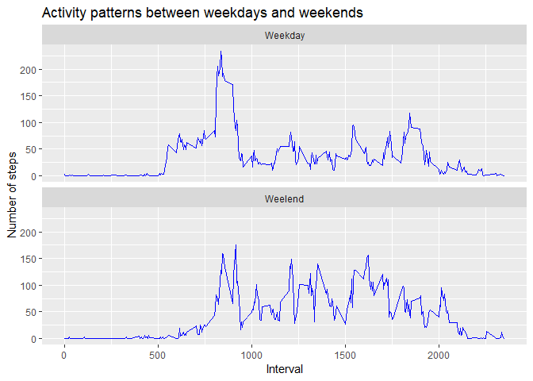

```
## 
## Attaching package: 'dplyr'
```

```
## The following objects are masked from 'package:stats':
## 
##     filter, lag
```

```
## The following objects are masked from 'package:base':
## 
##     intersect, setdiff, setequal, union
```


## Loading and preprocessing the data


```r
activity <- read.csv("activity.csv")
activity <- transform(activity, date = as.Date(activity$date, "%Y-%m-%d"))
```

## What is mean total number of steps taken per day?


```r
steps <- activity %>% group_by(date) %>% summarise(Totalsteps = sum(steps), Mean = mean(steps), Median = median(steps))

subset(steps, select = c(date,Totalsteps))
```

```
## # A tibble: 61 x 2
##    date       Totalsteps
##    <date>          <int>
##  1 2012-10-01         NA
##  2 2012-10-02        126
##  3 2012-10-03      11352
##  4 2012-10-04      12116
##  5 2012-10-05      13294
##  6 2012-10-06      15420
##  7 2012-10-07      11015
##  8 2012-10-08         NA
##  9 2012-10-09      12811
## 10 2012-10-10       9900
## # ... with 51 more rows
```

```r
barplot(steps$Totalsteps, space = 0, names.arg = steps$date,
        xlab = "Date",
        ylab = "Number of steps",
        main = "Total number of steps")
```

<!-- -->


```r
DT::datatable(subset(steps, select = c(date, Mean, Median)),
              rownames = FALSE,
              caption = "Mean and median")
```

<!--html_preserve--><div id="htmlwidget-e9cf679f5be16ff74ba6" style="width:100%;height:auto;" class="datatables html-widget"></div>
<script type="application/json" data-for="htmlwidget-e9cf679f5be16ff74ba6">{"x":{"filter":"none","caption":"<caption>Mean and median<\/caption>","data":[["2012-10-01","2012-10-02","2012-10-03","2012-10-04","2012-10-05","2012-10-06","2012-10-07","2012-10-08","2012-10-09","2012-10-10","2012-10-11","2012-10-12","2012-10-13","2012-10-14","2012-10-15","2012-10-16","2012-10-17","2012-10-18","2012-10-19","2012-10-20","2012-10-21","2012-10-22","2012-10-23","2012-10-24","2012-10-25","2012-10-26","2012-10-27","2012-10-28","2012-10-29","2012-10-30","2012-10-31","2012-11-01","2012-11-02","2012-11-03","2012-11-04","2012-11-05","2012-11-06","2012-11-07","2012-11-08","2012-11-09","2012-11-10","2012-11-11","2012-11-12","2012-11-13","2012-11-14","2012-11-15","2012-11-16","2012-11-17","2012-11-18","2012-11-19","2012-11-20","2012-11-21","2012-11-22","2012-11-23","2012-11-24","2012-11-25","2012-11-26","2012-11-27","2012-11-28","2012-11-29","2012-11-30"],[null,0.4375,39.4166666666667,42.0694444444444,46.1597222222222,53.5416666666667,38.2465277777778,null,44.4826388888889,34.375,35.7777777777778,60.3541666666667,43.1458333333333,52.4236111111111,35.2048611111111,52.375,46.7083333333333,34.9166666666667,41.0729166666667,36.09375,30.6284722222222,46.7361111111111,30.9652777777778,29.0104166666667,8.65277777777778,23.5347222222222,35.1354166666667,39.7847222222222,17.4236111111111,34.09375,53.5208333333333,null,36.8055555555556,36.7048611111111,null,36.2465277777778,28.9375,44.7326388888889,11.1770833333333,null,null,43.7777777777778,37.3784722222222,25.4722222222222,null,0.142361111111111,18.8923611111111,49.7881944444444,52.4652777777778,30.6979166666667,15.5277777777778,44.3993055555556,70.9270833333333,73.5902777777778,50.2708333333333,41.0902777777778,38.7569444444444,47.3819444444444,35.3576388888889,24.46875,null],[null,0,0,0,0,0,0,null,0,0,0,0,0,0,0,0,0,0,0,0,0,0,0,0,0,0,0,0,0,0,0,null,0,0,null,0,0,0,0,null,null,0,0,0,null,0,0,0,0,0,0,0,0,0,0,0,0,0,0,0,null]],"container":"<table class=\"display\">\n  <thead>\n    <tr>\n      <th>date<\/th>\n      <th>Mean<\/th>\n      <th>Median<\/th>\n    <\/tr>\n  <\/thead>\n<\/table>","options":{"columnDefs":[{"className":"dt-right","targets":[1,2]}],"order":[],"autoWidth":false,"orderClasses":false}},"evals":[],"jsHooks":[]}</script><!--/html_preserve-->

## What is the average daily activity pattern?


```r
interval <- activity %>% group_by(interval) %>% summarise(Mean = mean(steps, na.rm = TRUE))

plot(interval, type = "l",
     xlab = "Interval",
     ylab = "Number of steps",
     main = "Average daily activity pattern")
```

<!-- -->

```r
index <- which.max(interval$Mean)
interval[index,]
```

```
## # A tibble: 1 x 2
##   interval  Mean
##      <int> <dbl>
## 1      835  206.
```

## Imputing missing values


```r
tolalNA <- sum(is.na(activity$steps))
bads <- is.na(activity$steps)
newdata <- activity[!bads,]

newsteps <- newdata %>% group_by(date) %>% summarise( Totalsteps = sum(steps), Mean = mean(steps), Median = median(steps))

barplot(newsteps$Totalsteps, space = 0, names.arg = newsteps$date,
        xlab = "Date",
        ylab = "Number of steps",
        main = "Total number of steps (imputing missing values)")
```

<!-- -->

```r
DT::datatable(subset(newsteps, select = c(date, Mean, Median)),
              rownames = FALSE,
              caption = "Mean and median (imputing missing values)")
```

<!--html_preserve--><div id="htmlwidget-c8232a4cdaa1fbce942b" style="width:100%;height:auto;" class="datatables html-widget"></div>
<script type="application/json" data-for="htmlwidget-c8232a4cdaa1fbce942b">{"x":{"filter":"none","caption":"<caption>Mean and median (imputing missing values)<\/caption>","data":[["2012-10-02","2012-10-03","2012-10-04","2012-10-05","2012-10-06","2012-10-07","2012-10-09","2012-10-10","2012-10-11","2012-10-12","2012-10-13","2012-10-14","2012-10-15","2012-10-16","2012-10-17","2012-10-18","2012-10-19","2012-10-20","2012-10-21","2012-10-22","2012-10-23","2012-10-24","2012-10-25","2012-10-26","2012-10-27","2012-10-28","2012-10-29","2012-10-30","2012-10-31","2012-11-02","2012-11-03","2012-11-05","2012-11-06","2012-11-07","2012-11-08","2012-11-11","2012-11-12","2012-11-13","2012-11-15","2012-11-16","2012-11-17","2012-11-18","2012-11-19","2012-11-20","2012-11-21","2012-11-22","2012-11-23","2012-11-24","2012-11-25","2012-11-26","2012-11-27","2012-11-28","2012-11-29"],[0.4375,39.4166666666667,42.0694444444444,46.1597222222222,53.5416666666667,38.2465277777778,44.4826388888889,34.375,35.7777777777778,60.3541666666667,43.1458333333333,52.4236111111111,35.2048611111111,52.375,46.7083333333333,34.9166666666667,41.0729166666667,36.09375,30.6284722222222,46.7361111111111,30.9652777777778,29.0104166666667,8.65277777777778,23.5347222222222,35.1354166666667,39.7847222222222,17.4236111111111,34.09375,53.5208333333333,36.8055555555556,36.7048611111111,36.2465277777778,28.9375,44.7326388888889,11.1770833333333,43.7777777777778,37.3784722222222,25.4722222222222,0.142361111111111,18.8923611111111,49.7881944444444,52.4652777777778,30.6979166666667,15.5277777777778,44.3993055555556,70.9270833333333,73.5902777777778,50.2708333333333,41.0902777777778,38.7569444444444,47.3819444444444,35.3576388888889,24.46875],[0,0,0,0,0,0,0,0,0,0,0,0,0,0,0,0,0,0,0,0,0,0,0,0,0,0,0,0,0,0,0,0,0,0,0,0,0,0,0,0,0,0,0,0,0,0,0,0,0,0,0,0,0]],"container":"<table class=\"display\">\n  <thead>\n    <tr>\n      <th>date<\/th>\n      <th>Mean<\/th>\n      <th>Median<\/th>\n    <\/tr>\n  <\/thead>\n<\/table>","options":{"columnDefs":[{"className":"dt-right","targets":[1,2]}],"order":[],"autoWidth":false,"orderClasses":false}},"evals":[],"jsHooks":[]}</script><!--/html_preserve-->


## Are there differences in activity patterns between weekdays and weekends?


```r
Sys.setlocale("LC_ALL","English")
```

```
## [1] "LC_COLLATE=English_United States.1252;LC_CTYPE=English_United States.1252;LC_MONETARY=English_United States.1252;LC_NUMERIC=C;LC_TIME=English_United States.1252"
```

```r
week <- weekdays(newdata$date, abbreviate = TRUE)
weektype <- factor(week, 
                   levels = c("Mon", "Tue", "Wed", "Thu", "Fri", "Sat", "Sun"),
                   labels = c(rep("Weekday", 5), rep("Weelend", 2)))

newdataupdated <- newdata %>% mutate(weektype = weektype)
newstepsupdated <- newdataupdated %>% group_by(weektype, interval) %>% summarise(Mean = mean(steps))

ggplot(newstepsupdated, aes(x = interval, y = Mean)) +
  geom_line(col = "blue") +
  facet_wrap(~ weektype, nrow = 2) +
  labs(x = "Interval", y = "Number of steps", 
       title = "Activity patterns between weekdays and weekends")
```

<!-- -->
